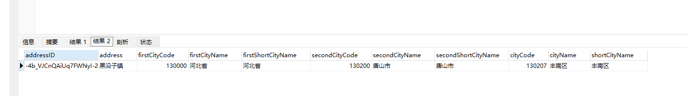
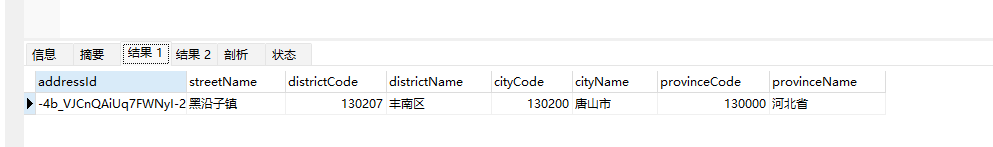

1. CompanyFeign.findCompanysByIds()
2. CompanyFeign.findSimpCompanyById
3. CompanyFeign.findCompanyByName
4. SettingFeign.getProvinceCityDistrictByIds  //tips 返回结果映射看下图比较
   原sql 结果

新sql结果

5. SettingFeign.detailAddressByAreaCode(dto)
   入参下面俩
/**
 * 街道地址
 */
private String streetName;
/**
 * 行政区划ID
 */
private Long administratorDivisionId;

6. 后续依赖接口文档：https://ones.tjzwzn.cn/wiki/#/team/WbzjQyvo/space/CuENBUAM/page/WEkhK5C6